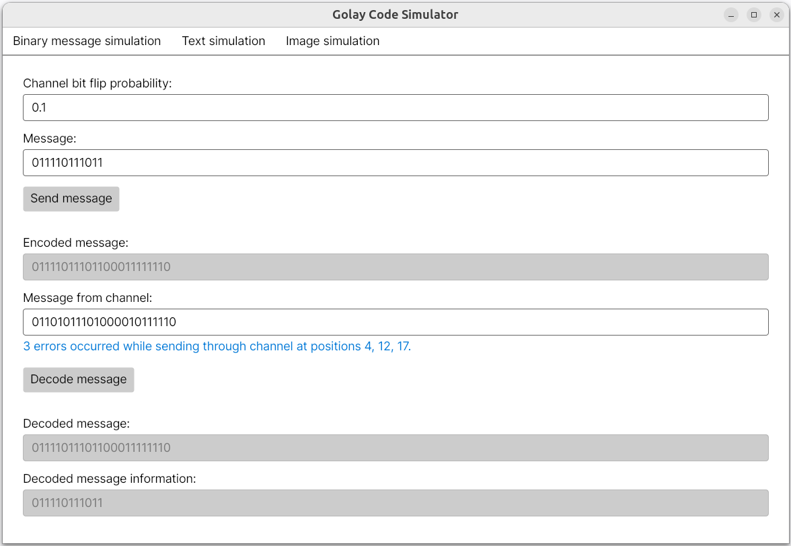
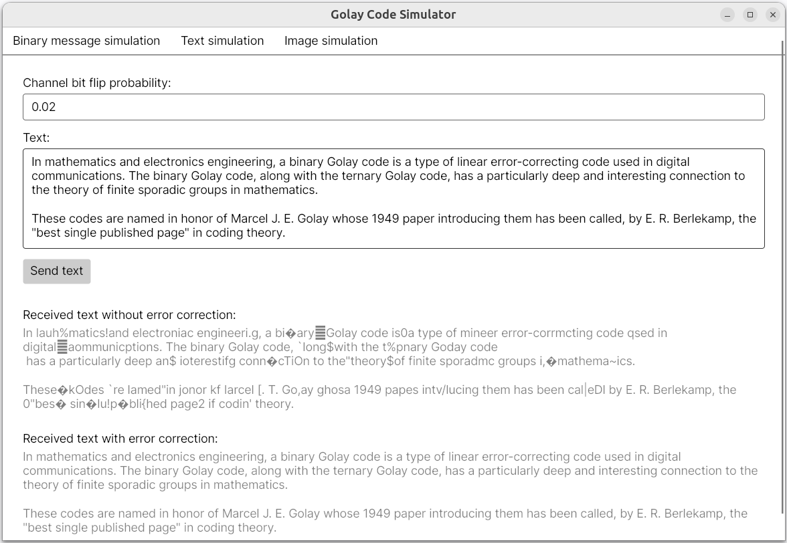

# Golay Code Simulator

## Overview

The Perfect Binary Golay Code (23, 12, 7) is a type of error-correcting code used in coding theory. It is a binary block code with highly efficient error detection and correction capabilities, particularly known for its applications in areas like communications and information theory.

The simulator models the process of encoding a message, transmitting it through a [Binary Symmetric Channel](https://en.wikipedia.org/wiki/Binary_symmetric_channel), and then decoding it using the Golay code. Encoding and decoding algorithms are implemented based on the book _A First Course in Coding Theory_ by R. A. Hill.

[Full description](./docs/Golay_kodo_veikimo_modeliavimas.pdf) of the project is available in Lithuanian language.

## Technologies Used

- **.NET 8:** Secure, reliable and high-performance application platform
- **Avalonia UI:** Cross-platform user interface framework for .NET
- **xUnit:** Testing framework for .NET

## Examples

### Sending message through channel

### Sending text through channel

### Sending image through channel

